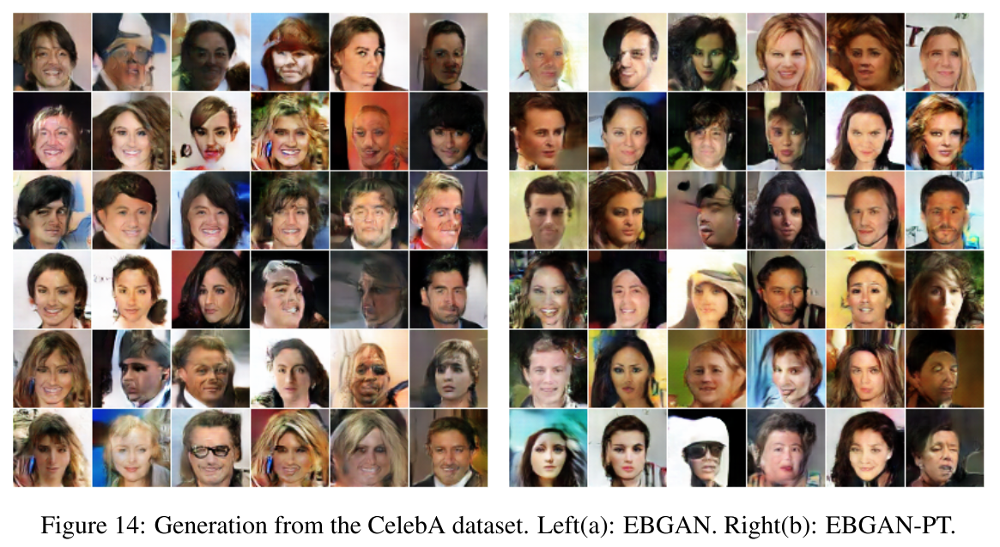
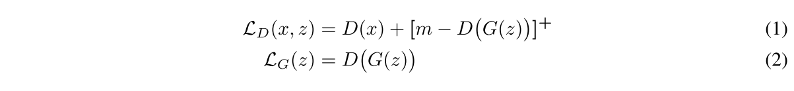
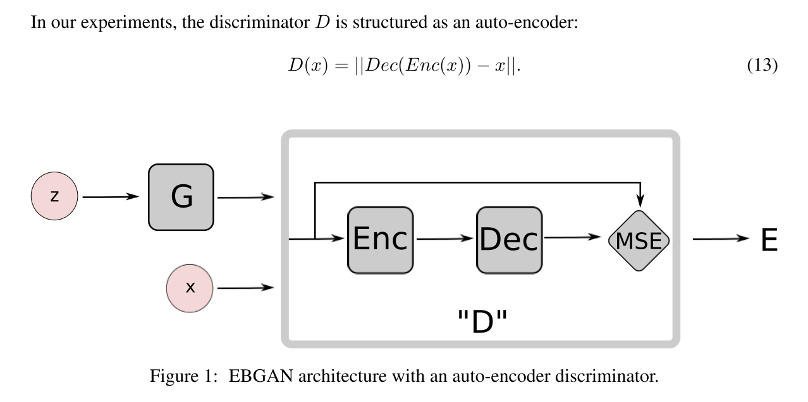
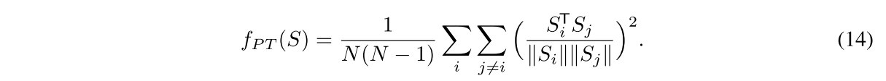
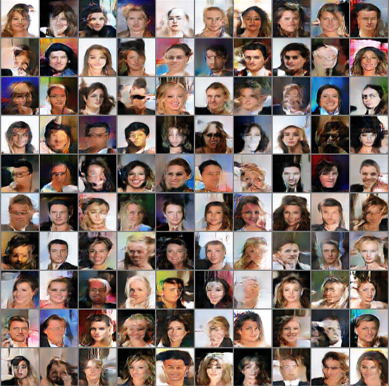

# EBGAN : Energy-based Generative Adversarial Network
<br>

### Overview
Pytorch implementation of EBGAN([arxiv:1609.03126])


## Objectives


## Architectures


## Repelling Regularizer

<br>

### Dependencies
```
python 3.6.4
pytorch 0.3.1.post2
visdom
```
<br>

### Result : CelebA(aligned, 64x64)
(you can download CelebA dataset [here])
```
python -m visdom.server
python main.py --dataset CelebA --epoch 15 --batch_size 128 --PT_ratio 0.1 --m 20 --hidden_dim 256 --noise_dim 100
```

<br>

### [data directory tree]
```
.
└── data
    └── CelebA
        └── img_align_celeba
            ├── 000001.jpg
            ├── 000002.jpg
            ├── ...
            └── 202599.jpg
    ├── custom_dataset
        └── folder1
            ├── image1.jpg
            ├── ...
    └── ...
```
<br>

### References
1. EBGAN : Energy-based Generative Adversarial Network([arxiv:1609.03126])

[arxiv:1609.03126]: http://arxiv.org/abs/1609.03126
[here]: http://mmlab.ie.cuhk.edu.hk/projects/CelebA.html
[data directory tree]: http://pytorch.org/docs/master/torchvision/datasets.html?highlight=image%20folder#torchvision.datasets.ImageFolder
